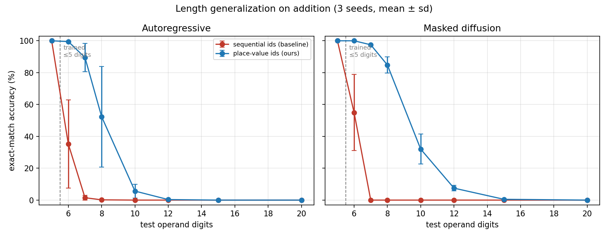
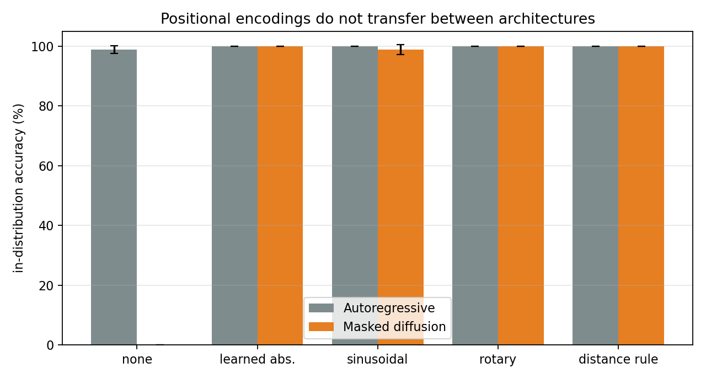
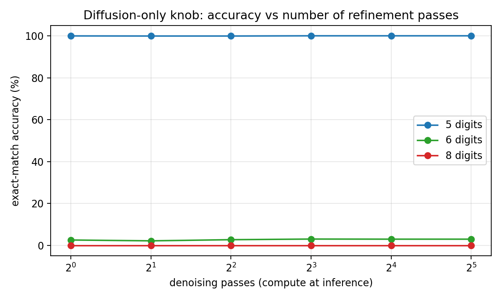

# Length Generalization in Masked Diffusion Language Models

**Place-value position identifiers let from-scratch masked diffusion models solve
arithmetic problems longer than any they were trained on.**

Everything here is trained **from random initialization** — no pretrained
weights, no pretrained tokenizer, no distillation from a larger model. Models are
~10.7M parameters and train in roughly 20 minutes on a single A100 MIG slice.

- Code: this repository
- Weights, results and figures: [huggingface.co/GOVINDFROM/masked-diffusion-length-generalization](https://huggingface.co/GOVINDFROM/masked-diffusion-length-generalization)

---

## 1. The problem

A language model that has learned *how to add* should add numbers of any length.
A model that has merely fit the training distribution will fail as soon as the
numbers get longer. Telling these apart is the cleanest available test of whether
a generative model learned an algorithm or a pattern.

This question is well studied for **autoregressive** models, which generate one
token at a time, left to right. It is essentially unstudied for **masked
diffusion language models**, which start with the whole answer hidden and reveal
it over several refinement passes, in an order they choose. Diffusion language
models are now being built at scale (LLaDA, Mercury, Gemini Diffusion) precisely
because that parallel, revisable generation is fast and can correct itself — so
how they extrapolate matters.

The obvious move is to import what works for autoregressive models. **We show
that fails, sometimes catastrophically, and explain why.**

---

## 2. Background: the two architectures

Both use the *same* transformer. Only the attention mask and the training
objective differ, so every comparison here is matched.

### Autoregressive
Causal attention — position *i* sees only positions ≤ *i*. Trained with
next-token prediction. Generates greedily, left to right, and can never revise.

### Masked diffusion (MDLM-style, absorbing state)
Bidirectional attention — every position sees every other. Training corrupts the
answer by replacing each token independently with a `[MASK]` placeholder with
probability *t* (sampled per example), then asks the model to restore the
originals, weighting the loss by `1/t`. Generation reverses this: start fully
masked, and over *T* passes repeatedly predict every hidden slot and reveal the
most confident ones.

```
pass 0:  __ __ __        (everything hidden)
pass 1:  __ __  2
pass 2:  __  3  2
pass 3:   1  3  2
```

This is diffusion in the formal sense — the same destroy-then-learn-to-restore
framework as image diffusion, with masking in place of Gaussian noise
(D3PM, Austin et al. 2021; MDLM, Sahoo et al. 2024).

---

## 3. Method: place-value position identifiers

A transformer has no inherent sense of order, so position must be supplied. The
standard choice numbers tokens by **where they sit in the sequence**. We instead
number every digit by its **place value**:

```
 4   7   +   8   5   =   1   3   2
tens un.      tens un.    hun tens un.
 2   1   0    2   1   0    3   2   1
```

Digits that must be combined now share an identifier. The rule *"combine equal
identifiers, carry into identifier + 1"* does not mention how many digits the
operands have, so it applies unchanged at any length.

Three details make it work:

| Component | Why it is needed |
|---|---|
| **Random offset** | A per-example constant is added to every identifier, so the model keys on *relative* place value and encounters large identifiers during training rather than only small ones. |
| **Segment embeddings** | Place-value identifiers deliberately collide — the units digits of operand A, operand B and the answer all carry identifier 1. A causal model separates them via the attention mask; **a bidirectional model cannot**, so diffusion needs an explicit marker for which part of the equation a token belongs to. This component is required for diffusion and optional for autoregressive. |
| **Terminator identifier** | The end-of-sequence token gets its own place-value identifier rather than sharing padding's. Without this the model produces perfectly correct digits but cannot tell which slot should terminate. |

The middle row is the part that is genuinely specific to diffusion, and it falls
directly out of the failure analysis in §5.

> **Prior work.** Numbering arithmetic tokens by place value is established for
> *autoregressive* models (position coupling; Abacus embeddings). We do not claim
> that idea. Our contribution is the adaptation to bidirectional masked
> diffusion — which does not work without the segment component — together with
> the evidence that naive transfer of positional schemes across the two
> architectures fails.

---

## 4. Experiments

90 runs across four studies, 3 seeds each.

| Study | What it varies | Runs |
|---|---|---|
| **A — Main** | place-value vs sequential identifiers × {autoregressive, diffusion} × {learned absolute, distance rule} | 24 |
| **B — Encodings** | 5 positional encodings × 2 architectures | 30 |
| **C — Ablation** | segment embeddings on/off × random offset on/off × 2 architectures | 24 |
| **D — Transfer** | multiplication, where place value is *not* the algorithm | 12 |

### Tasks

**Addition** — train on 1–5 digit operands, test at 5, 6, 7, 8, 10, 12, 15 and 20
digits. Answers are written units-first, the standard format in this literature;
it removes the autoregressive model's need to know the final carry before
emitting its first token, so the baseline is the strong version rather than a
straw man. Both architectures receive identical data.

**Multiplication** — train on 1–3 digits, test to 7. Included deliberately as the
adversarial case: multiplication's algorithm is *not* place-local (each output
digit depends on many input pairs), so it tests whether the method works only
when place-value alignment happens to match the dependency structure.

**Sorting** — an order-insensitive control. Every output position is computable
independently, so if our effects appeared here too they would be about sequence
length generally rather than about reasoning order.

### Metrics

| Metric | Definition |
|---|---|
| **Exact match** | The entire answer must be correct. No partial credit. Checked by a deterministic program — no human judges, no model-as-judge. |
| **Per-digit accuracy** | Fraction of answer digits correct, aligned from the units end. Shows graded degradation that exact match hides. |
| **Hardness envelope H\*(ε)** | The largest operand length at which a model still exceeds accuracy ε. One comparable number per configuration. |
| **Accuracy vs denoising passes** | Accuracy as a function of refinement passes *T*. A diffusion-only axis with no autoregressive equivalent; reported as a curve so no single favourable *T* is cherry-picked. |

### Model and training

6 layers, 384 hidden dimensions, 6 heads, ~10.7M parameters, symbol-level
vocabulary built from the data. AdamW, learning rate 1e-4, 300-step warm-up then
cosine decay, weight decay 0.01, bfloat16, effective batch 256, 10,000 steps on
200,000 examples.

---

## 5. What we found

### The method works, and masked diffusion benefits more than autoregressive

Trained on operands of at most 5 digits, tested far beyond. With place-value
identifiers, diffusion holds **84.8%** at 8 digits and **32.0%** at 10, where the
autoregressive model with the same treatment manages 52.3% and 5.7%. Both
baselines are effectively dead by 7 digits.

Per-digit accuracy shows why this is an algorithm rather than a lookup: at **20
digits — four times the training length — the model still places 68.9% of
individual digits correctly**, degrading gracefully rather than collapsing into
noise.

### Positional encodings do not transfer between architectures

Supplying no positional information at all gives autoregressive models 98.8%
in-distribution accuracy and leaves masked diffusion at **0%** — unable to learn
the task on any seed. An autoregressive model reads tokens in order, so position
is implicit in the act of reading; the literature showing that *no* encoding is
best for length generalization rests on exactly that implicit signal. A diffusion
model sees every position at once, and without a positional signal it is holding
an unordered bag of digits.

**Rotary embeddings are the strongest pairing**, reaching 10 digits for
autoregressive and **12 for diffusion**.

### Segment embeddings matter far more for autoregressive models

Removing them costs the autoregressive model everything (0% at 6 digits) while
diffusion still reaches 72%. This is the opposite of what we first concluded: an
earlier apparent diffusion failure turned out to be the terminator bug described
below, not a missing segment signal.

### The method does not transfer to multiplication

Every configuration collapses (~2.7% at 3 digits, 0 beyond). Multiplication's
algorithm is not place-local — each output digit depends on many input pairs —
so aligning place values does not align the computation. The method helps when
the alignment matches the algorithm's dependency structure, and not otherwise.

### Length-generalization accuracy has very high seed variance

One configuration spanned 3%–68% across seeds. Single-seed comparisons here —
including published ones — should be treated with suspicion. Every number in
this repository is mean ± standard deviation over 3 seeds.

### Two bugs that the numbers alone would have hidden

The terminator token originally shared padding's position identifier, so the
model produced **perfectly correct digits** and scored 0% because it could not
tell which slot should end the sequence. Separately, an audit
(`src/audit.py`) found that target identifiers were assigned only to written
slots, which handed the model the answer length for free — information the
baseline never received. Both are fixed; the affected runs were discarded rather
than reported.

### Figures



**Figure 1.** Length generalization on addition. Sequential position identifiers
(red) collapse the moment the numbers exceed the training range; place-value
identifiers (blue) hold well beyond it. Shaded bars are ± 1 standard deviation
over 3 seeds; the dashed line marks the longest length seen in training.



**Figure 2.** The same positional encoding produces opposite outcomes in the two
architectures. Schemes that give autoregressive models perfect in-distribution
accuracy leave masked diffusion unable to learn the task at all.



**Figure 3.** Accuracy against the number of denoising passes — compute spent
purely at inference, with no autoregressive equivalent. Reported as a full curve
so that no single favourable step count is cherry-picked.

<!-- RESULTS:START -->
# Results

## Table 1 — Main result (addition, distance-rule encoding)

| configuration | 5d | 6d | 7d | 8d | 10d | 12d | 15d | 20d | H*(50%) |
|---|---|---|---|---|---|---|---|---|---|
| Autoregressive / baseline | 100.0±0 | 35.2±28 | 1.5±1 | 0.2±0 | 0.0±0 | 0.0±0 | 0.0±0 | 0.0±0 | 5 |
| Autoregressive / **ours** | 100.0±0 | 99.5±0 | 89.5±9 | 52.3±32 | 5.7±4 | 0.3±0 | 0.0±0 | 0.0±0 | 8 |
| Masked diffusion / baseline | 100.0±0 | 55.0±24 | 0.0±0 | 0.0±0 | 0.0±0 | 0.0±0 | 0.0±0 | 0.0±0 | 6 |
| Masked diffusion / **ours** | 100.0±0 | 100.0±0 | 97.5±0 | 84.8±5 | 32.0±9 | 7.5±2 | 0.5±0 | 0.0±0 | 8 |

## Table 2 — Positional encoding sweep (place-value ids)

| encoding | AR in-dist | AR H*(50%) | Diffusion in-dist | Diffusion H*(50%) |
|---|---|---|---|---|
| none | 98.8±1 | 6 | 0.0±0 | 0 |
| learned abs. | 100.0±0 | 6 | 100.0±0 | 8 |
| sinusoidal | 100.0±0 | 6 | 98.8±2 | 6 |
| rotary | 100.0±0 | 10 | 100.0±0 | 12 |
| distance rule | 100.0±0 | 7 | 100.0±0 | 8 |

## Table 3 — Component ablation (addition, distance rule)

| segments | random offset | architecture | 6d | 8d | 12d | H*(50%) |
|---|---|---|---|---|---|---|
| no | no | Autoregressive | 0.0 | 0.0 | 0.0 | 0 |
| no | no | Masked diffusion | 72.0 | 52.2 | 2.7 | 8 |
| no | yes | Autoregressive | 0.0 | 0.0 | 0.0 | 0 |
| no | yes | Masked diffusion | 73.0 | 58.7 | 4.8 | 8 |
| yes | no | Autoregressive | 99.0 | 15.7 | 0.0 | 7 |
| yes | no | Masked diffusion | 99.5 | 86.5 | 13.8 | 8 |
| yes | yes | Autoregressive | 100.0 | 27.5 | 0.0 | 7 |
| yes | yes | Masked diffusion | 99.8 | 75.7 | 11.5 | 8 |

## Table 4 — Multiplication (place value is NOT the algorithm)

| configuration | 3d | 4d | 5d | 6d | 7d |
|---|---|---|---|---|---|
| Autoregressive / baseline | 2.2±0 | 0.0±0 | 0.0±0 | 0.0±0 | 0.0±0 |
| Autoregressive / **ours** | 2.7±1 | 0.0±0 | 0.0±0 | 0.0±0 | 0.0±0 |
| Masked diffusion / baseline | 0.5±0 | 0.0±0 | 0.0±0 | 0.0±0 | 0.0±0 |
| Masked diffusion / **ours** | 2.7±1 | 0.0±0 | 0.0±0 | 0.0±0 | 0.0±0 |

## Table 5 — Per-digit accuracy (partial credit)

| configuration | 6d | 8d | 12d | 20d |
|---|---|---|---|---|
| Autoregressive / baseline | 84.8 | 47.4 | 6.9 | 3.6 |
| Autoregressive / **ours** | 99.9 | 87.7 | 45.8 | 21.4 |
| Masked diffusion / baseline | 90.0 | 34.4 | 9.1 | 0.4 |
| Masked diffusion / **ours** | 100.0 | 98.0 | 84.1 | 65.2 |


<!-- RESULTS:END -->

---

## 6. Repository layout

```
src/
  data.py            task generators: addition, multiplication, sorting, star-graph
  model.py           transformer with swappable positional encoding + attention mask
  train_add.py       main trainer (place-value ids, both architectures, all metrics)
  train.py           earlier trainer for the sorting / star-graph studies
  collect.py         aggregates every run into tables and figures
  trace.py           prints a diffusion denoising trajectory
  debug_coupled.py   prediction inspection used to find the terminator bug
slurm/
  grid.sh            the full 90-run grid
  finalize.sh        runs automatically after training: back up + push
push_to_hf.py        stage results and upload to the Hugging Face Hub
```

### Reproducing

```bash
# one run
python src/train_add.py --mode diff --op add --pe alibi --coupled 1 \
    --segments 1 --seed 0 --digits 5 --steps 10000 --out runs/demo

# the full grid (SLURM)
sbatch slurm/grid.sh

# tables and figures
RUNS=runs OUT=figures python src/collect.py
```

---

## 7. Honest limitations

- **Arithmetic is a probe, not an application.** A 10.7M-parameter adder is
  useless as a calculator. The claim is about the model class, not the task.
- **Place-value numbering is not our idea** — only its adaptation to
  bidirectional diffusion, and the accompanying negative transfer result.
- **Nothing here reaches the very long lengths** reported by the best
  autoregressive arithmetic work, which uses larger models and longer training.
- **Multiplication is included precisely because it may not work**; if the method
  only helps when place-value alignment matches the algorithm, that is a real
  boundary and is reported as one.

---

## 8. References

- Austin et al. *Structured Denoising Diffusion Models in Discrete State-Spaces* (D3PM). NeurIPS 2021.
- Sahoo et al. *Simple and Effective Masked Diffusion Language Models* (MDLM). NeurIPS 2024.
- Ye et al. *Beyond Autoregression: Discrete Diffusion for Complex Reasoning and Planning*. ICLR 2025.
- Kazemnejad et al. *The Impact of Positional Encoding on Length Generalization in Transformers*. 2023.
- Press et al. *Train Short, Test Long: Attention with Linear Biases* (ALiBi). ICLR 2022.
- Su et al. *RoFormer: Rotary Position Embedding*. 2021.
- Ruoss et al. *Randomized Positional Encodings Boost Length Generalization*. ACL 2023.
- Bachmann & Nagarajan. *The Pitfalls of Next-Token Prediction*. ICML 2024.

Trained on the University of Maryland Zaratan cluster.
